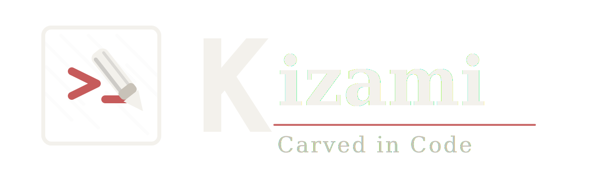

<p align="center">
  
</p>

> Keep your docs honest.

**kizami** is a minimal CLI tool to maintain living documentation alongside code, with automatic drift detection.

Design decisions tend to get scattered across Issues, PRs, and Slack — and eventually lost.
kizami saves them as Markdown files alongside your code, so the reasoning behind every choice stays in the repository forever.

[日本語版はこちら](ja/)

---

## For first-time users

Looking for installation instructions or a quick start guide?

→ See the [README on GitHub](https://github.com/mskasa/kizami#readme)

---

## Documentation

This site is for users who have already installed kizami. It covers how to use it day-to-day and how to run it effectively as part of your team's workflow.

| Page | Contents |
|---|---|
| [Development Workflow](workflow) | How kizami fits into your daily development process |
| [ADR Guide](adr-guide) | How to write ADRs: granularity, templates, and status management |
| [Best Practices](best-practices) | Tips for getting the most out of kizami |

---

## What is kizami?

kizami records two types of documents:

**ADRs (Architecture Decision Records)** — Capture *why* a technical decision was made.
Stored under `docs/decisions/` by default.

**Design Documents** — Capture *how* something is designed.
Stored under `docs/design/` by default.

Both types support a `## Related Files` section that links the document to source files.
`kizami audit` detects when those files are deleted or moved — keeping your documentation honest.

```bash
$ kizami adr "use PostgreSQL over SQLite"
Created: docs/decisions/2026-03-12-use-postgresql-over-sqlite.md

$ kizami audit
✓ All related files exist.
```
