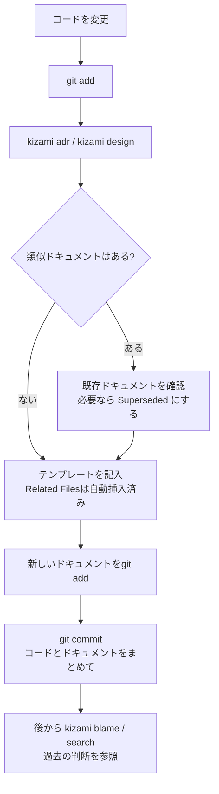

# 開発ワークフロー

kizamiを日常の開発プロセスにどう組み込むかを説明します。

[← ドキュメントトップへ](.)

---

## 基本の流れ

意味のある技術的判断を伴う変更を行ったときは、ADRや設計ドキュメントとして、**変更と同じコミット**に記録しましょう。



---

## 初期セットアップ

リポジトリで一度 `kizami init` を実行します。以下を対話形式で作成します。すべてオプションで、一つずつ確認しながら進みます：

| 生成物 | 用途 |
|---|---|
| `docs/decisions/` | ADRの保存ディレクトリ |
| `docs/design/` | 設計ドキュメントの保存ディレクトリ |
| `kizami.toml` | デフォルト値入りの設定ファイル |
| `.github/workflows/adr-check.yml` | ドキュメントなしのPRに警告するワークフロー |
| `.git/hooks/pre-commit` | コミット前にドキュメント作成を促すフック |
| `.github/workflows/adr-audit.yml` | 週次の乖離検出・GitHub Issue自動作成 |
| `.github/workflows/kizami-promote.yml` | mainへのpush時にDraft→Activeを自動昇格 |

### PRドキュメントチェック（`adr-check.yml`）

すべてのプルリクエストでトリガーします。PR本文にドキュメントディレクトリへの言及があるか、変更ファイルにドキュメントが含まれていれば通過します。いずれでもなければ**警告を表示しますが、CIをブロックしません**。PRタイトルに `[skip-doc]` を含めるとスキップできます。

### pre-commitフック

すべてのコミットで、2つのチェックを実行します：

1. **Related Filesチェック** — ステージされたファイルが、既存のActiveドキュメントのRelated Filesに含まれている場合、そのドキュメントがステージされていなければ、確認を促すメッセージを表示します。
2. **新規ドキュメントチェック** — ドキュメントがステージされておらず、かつMarkdown以外のファイルが含まれている場合に、ドキュメント作成を促すメッセージを表示します。

**コミットはブロックしません**。どちらのチェックも通知のみです。

---

## ステップごとの解説

### 1. コードを変更する

通常通りコードを変更します。準備ができたら `git add` でステージングします。

```bash
git add internal/db/db.go
```

### 2. ADRを作成する

> ここでは例としてADRを使って説明します。設計ドキュメントの場合は `kizami design` を使います。

`kizami adr` に意思決定を表すタイトルをつけて実行します。

```bash
kizami adr "データベースアクセスにコネクションプールを使う"
```

kizamiは以下を自動で行います：
- **ステージ済みファイルを自動挿入** → `## Related Files` セクションへ
- **類似ADRを表示** → タイトルが部分一致する既存ドキュメントがあれば提示
- 生成されたファイルを `$EDITOR` で開く

`--ai` フラグを付けると、ステージ済みの差分をもとにAIがドラフトを自動生成します：

```bash
kizami adr --ai "データベースアクセスにコネクションプールを使う"
```

### 3. 既存の意思決定を更新する（必要な場合）

新しいADRが既存のADRを置き換える場合は、コミット前に Superseded 状態にしておきます。

```bash
kizami status 2026-03-01-use-single-db-connection superseded --by 2026-03-12-use-connection-pooling
```

### 4. コードとドキュメントをまとめてコミット

コード変更と新しいADRを同じコミットに含めます。こうすることで、意思決定と実装がGitの履歴上で常に紐付いた状態になります。

```bash
git add docs/decisions/2026-03-12-use-connection-pooling.md
git commit -m "feat: データベースアクセスにコネクションプールを追加"
```

### 5. 過去の判断を参照する

いつでも `kizami blame` や `kizami search` を使って、なぜそのように実装されたかを追跡できます。

```bash
# 特定のファイルを参照しているADRを逆引き
kizami blame internal/db/db.go

# キーワードで検索
kizami search "コネクションプール"
```

VS Codeをお使いの場合は、[kizami拡張機能](editor-integration)を使うとファイルを開くたびにサイドバーに関連ドキュメントが自動表示されます。`kizami blame` を手動で実行する必要はありません。

---

## 定期メンテナンス

### 陳腐化したドキュメントを検出する

```bash
kizami review
```

長期間更新されていないドキュメントを一覧表示します。デフォルトの閾値は6ヶ月で、`--months N` フラグまたは `kizami.toml` の `months_threshold` で変更できます。定期的なチームレビューに活用できます。

### ドキュメント構造を検証する

```bash
kizami lint
```

すべてのドキュメントの構造上の問題を検出します。`- Status:` フィールドの欠落・`## Related Files` セクションが空・パスが解決不能など。問題があると終了コードが非ゼロになるため、CIでの利用に適しています。

### ドキュメントとコードの乖離を検出する

```bash
kizami audit
```

Markdownドキュメントの `## Related Files` エントリと `.kizami` サイドカーファイル（後述）の `related:` エントリを確認します。参照されているファイルが削除・移動されていた場合に報告します。

`kizami init` で生成される `adr-audit.yml` で自動化できます（[初期セットアップ](#初期セットアップ)を参照）。

---

## Markdown以外のファイルを管理する

追跡すべきファイルはMarkdownだけではありません。CSVテストマトリクス・OpenAPI仕様書・SQLスキーマ——これらはコードと同様に重要であり、同様に静かに乖離していきます。しかし、kizamiのマーカーを直接書くことはできません。

そのような場合は、`.kizami` サイドカーファイルを管理対象ファイルの隣に置きます：

```
data/
  test_matrix.csv
  test_matrix.csv.kizami   ← サイドカー
```

```yaml
# data/test_matrix.csv.kizami
title: ユーザーフローのテストマトリクス
date: 2026-04-17
author: your name
related:
  - tests/user_flow_test.go
```

サイドカーには `status` フィールドがなく、常に `kizami audit` の対象になります。
`date` フィールドは作成日を記録し、更新履歴はgitで管理されます。
