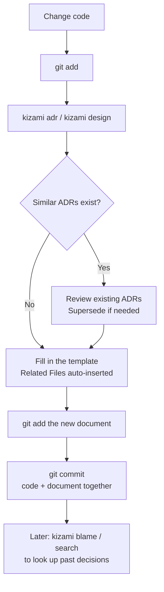

# Development Workflow

This page shows how kizami fits into your day-to-day development process.

[← Back to Documentation](.)

---

## The Core Loop

When you make a code change that involves a meaningful technical decision, record it alongside the code change — in the same commit.



---

## Step by Step

### 1. Change code

Make your code changes as usual. Stage them with `git add` when ready.

```bash
git add internal/db/db.go
```

### 2. Create an ADR

Run `kizami adr` with a title describing the decision.

```bash
kizami adr "use connection pooling for database access"
```

kizami will:
- **Auto-insert staged files** into the `## Related Files` section
- **Show similar ADRs** if any existing documents partially match the title
- Open the generated file in your `$EDITOR`

Add `--ai` to have AI generate a draft based on your staged diff:

```bash
kizami adr --ai "use connection pooling for database access"
```

### 3. Handle existing decisions (if needed)

If an existing ADR is being replaced by the new one, mark it as superseded before committing:

```bash
kizami supersede 2026-03-01-use-single-db-connection --by 2026-03-12-use-connection-pooling
```

### 4. Commit code and document together

Include both the code change and the new ADR in the same commit, so the decision and the implementation are always linked in Git history.

```bash
git add docs/decisions/2026-03-12-use-connection-pooling.md
git commit -m "feat: add connection pooling for database access"
```

### 5. Look up past decisions

At any time, use `kizami blame` or `kizami search` to trace why something was done the way it was.

```bash
# Find all ADRs that reference a specific file
kizami blame internal/db/db.go

# Search by keyword
kizami search "connection pool"
```

---

## Periodic Maintenance

### Detect stale decisions

```bash
kizami review
```

Lists ADRs that haven't been updated in a long time (configurable threshold). Useful for a periodic team review.

### Detect drift

```bash
kizami audit
```

Checks every `## Related Files` entry in your Markdown documents and every `related:` entry in `.kizami` sidecar files. If a referenced file has been deleted or moved without updating the document, `kizami audit` will flag it.

You can automate this with the GitHub Actions workflow generated by `kizami init`:

```bash
kizami init
# Generates .github/workflows/kizami-audit.yml
```

---

## Managing Non-Markdown Files

Some artifacts — CSV test matrices, OpenAPI specs, SQL schemas, images — are worth tracking for drift but cannot carry kizami markers directly.
Use a `.kizami` sidecar file placed alongside the managed file:

```
data/
  test_matrix.csv
  test_matrix.csv.kizami   ← sidecar
```

```yaml
# data/test_matrix.csv.kizami
title: Test matrix for user flow
date: 2026-04-17
author: your name
related:
  - tests/user_flow_test.go
```

The sidecar is treated as a first-class kizami document:

```bash
# Find documents related to a source file — includes sidecars
kizami blame tests/user_flow_test.go

# Shows the sidecar alongside Markdown docs
kizami list

# Displays the sidecar content
kizami show test_matrix.csv

# Flags the sidecar if test_matrix.csv is deleted or moved
kizami audit
```

Sidecars have no `status` field and are always included in `kizami audit`.
The `date` field records the creation date; update history is tracked by git.

---

## Design Documents vs. ADRs

| | ADR (`kizami adr`) | Design Document (`kizami design`) |
|---|---|---|
| **Purpose** | Record *why* a decision was made | Describe *how* something is designed |
| **Default status** | Draft | Draft |
| **Default directory** | `docs/decisions/` | `docs/design/` |
| **Typical lifecycle** | Draft → Active → (Inactive / Superseded) | Draft → Active |
| **Checked by audit** | Yes (Active only) | Yes (Active only) |

Both types use the same MADR-compatible template and support `## Related Files`.
