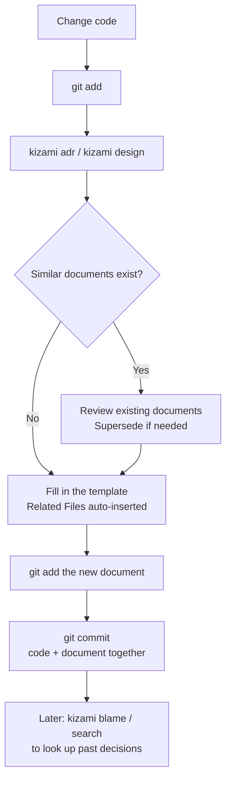

# Development Workflow

This page shows how kizami fits into your day-to-day development process.

[← Back to Documentation](.)

---

## The Core Loop

When you make a code change that involves a meaningful technical decision, record it alongside the code change — in the same commit.


```mermaid
flowchart TD
    A[Change code] --> B[git add]
    B --> C[kizami adr / kizami design]
    C --> D{Similar documents exist?}
    D -- Yes --> E[Review existing documents\nSupersede if needed]
    D -- No --> F[Fill in the template\nRelated Files auto-inserted]
    E --> F
    F --> G[git add the new document]
    G --> H[git commit\ncode + document together]
    H --> I[Later: kizami blame / search\nto look up past decisions]
```

---

## Initial Setup

Run `kizami init` once in your repository. It walks you through creating the following — each is optional and confirmed individually:

| Generated file | Purpose |
|---|---|
| `docs/decisions/` | Directory for ADRs |
| `docs/design/` | Directory for design documents |
| `kizami.toml` | Configuration file with default values |
| `.github/workflows/adr-check.yml` | Warns on PRs that include no document |
| `.git/hooks/pre-commit` | Reminds you to create a document before committing |
| `.github/workflows/adr-audit.yml` | Weekly drift detection, auto-creates a GitHub Issue |
| `.github/workflows/kizami-promote.yml` | Auto-promotes Draft → Active on push to main |

### PR document check (`adr-check.yml`)

Triggers on every pull request. Passes if the PR body references a document directory, or if the changed files include a document. Otherwise it shows a **warning — not a blocking failure**. Add `[skip-doc]` to the PR title to bypass it.

### Pre-commit hook

Runs on every commit. If no document is staged and the commit includes non-Markdown changes, it prints a reminder to consider creating a document. It **never blocks the commit** — it is a soft reminder only.

---

## Step by Step

### 1. Change code

Make your code changes as usual. Stage them with `git add` when ready.

```bash
git add internal/db/db.go
```

### 2. Create an ADR

> This example uses `kizami adr`. For design documents, use `kizami design` instead.

Run `kizami adr` with a title describing the decision.

```bash
kizami adr "use connection pooling for database access"
```

kizami will:
- **Auto-insert staged files** into the `## Related Files` section
- **Show similar ADRs** if any existing documents partially match the title
- Open the generated file in your `$EDITOR`

Add `--ai` to have AI generate a draft based on your staged diff:

```bash
kizami adr --ai "use connection pooling for database access"
```

### 3. Handle existing decisions (if needed)

If an existing ADR is being replaced by the new one, mark it as superseded before committing:

```bash
kizami status 2026-03-01-use-single-db-connection superseded --by 2026-03-12-use-connection-pooling
```

### 4. Commit code and document together

Include both the code change and the new ADR in the same commit, so the decision and the implementation are always linked in Git history.

```bash
git add docs/decisions/2026-03-12-use-connection-pooling.md
git commit -m "feat: add connection pooling for database access"
```

### 5. Look up past decisions

At any time, use `kizami blame` or `kizami search` to trace why something was done the way it was.

```bash
# Find all ADRs that reference a specific file
kizami blame internal/db/db.go

# Search by keyword
kizami search "connection pool"
```

If you use VS Code, the [kizami extension](editor-integration) shows related documents automatically in the sidebar whenever you open a file — no need to run `kizami blame` manually.

---

## Periodic Maintenance

### Detect stale decisions

```bash
kizami review
```

Lists documents that haven't been updated in a long time. The default threshold is 6 months; override it with `--months N` or set `months_threshold` in `kizami.toml`. Useful for a periodic team review.

### Validate document structure

```bash
kizami lint
```

Checks every document for structural issues — missing `- Status:` field, empty `## Related Files` section, unresolvable file paths. Exits non-zero when issues are found, making it suitable for CI.

### Detect drift

```bash
kizami audit
```

Checks every `## Related Files` entry in your Markdown documents and every `related:` entry in `.kizami` sidecar files. If a referenced file has been deleted or moved without updating the document, `kizami audit` will flag it.

You can automate this with the `adr-audit.yml` workflow generated by `kizami init` (see [Initial Setup](#initial-setup)).

---

## Managing Non-Markdown Files

Not everything worth tracking is a Markdown file. A CSV test matrix, an OpenAPI spec, a SQL schema — these are just as important as your code, and they drift just as silently. But you can't add kizami markers to them directly.

Use a `.kizami` sidecar file placed alongside the managed file:

```
data/
  test_matrix.csv
  test_matrix.csv.kizami   ← sidecar
```

```yaml
# data/test_matrix.csv.kizami
title: Test matrix for user flow
date: 2026-04-17
author: your name
related:
  - tests/user_flow_test.go
```

Sidecars have no `status` field and are always included in `kizami audit`.
The `date` field records the creation date; update history is tracked by git.
